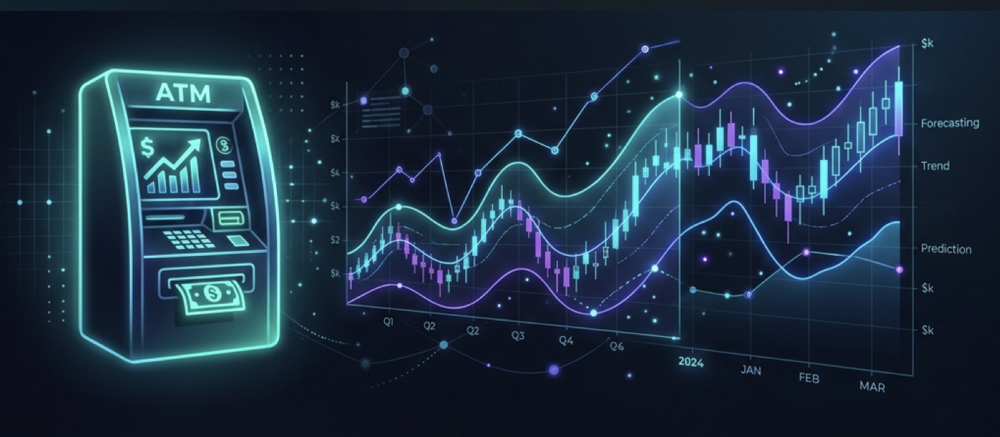
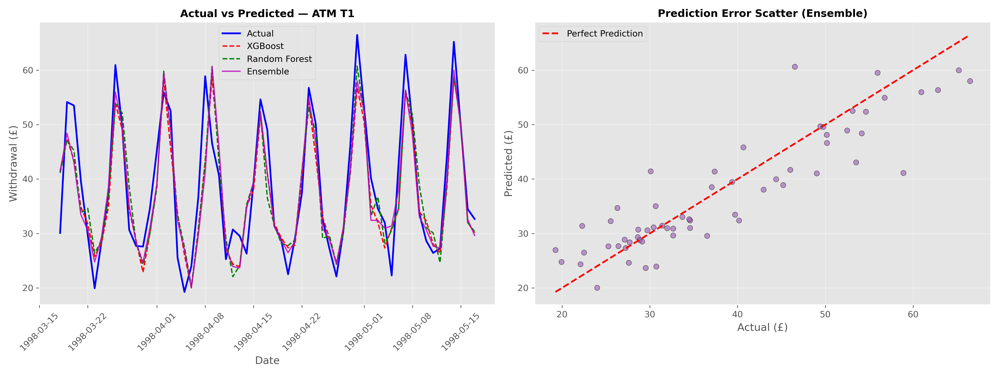

 <div align="center">



<br/>
<br/>

# ATM Cash Flow Forecasting

**Predicting daily cash withdrawals across 111 UK ATMs using ensemble machine learning**

<br/>

<a href="#quick-start"></a>&nbsp;&nbsp;
<a href="#results"></a>&nbsp;&nbsp;
<a href="#models"></a>&nbsp;&nbsp;
<a href="LICENSE"></a>

<br/>

<table>
<tr>
<td><b>Stack</b></td>
<td>


</td>
</tr>
</table>

</div>

<br/>

> **The Problem:** ATMs run out of cash → customers leave frustrated. ATMs hold too much cash → capital sits idle costing banks millions. This project forecasts exactly how much cash each ATM needs, each day, 56 days into the future.

<br/>

## At a Glance

<table>
<tr>
<td width="50%">

**What it does**
- Forecasts daily withdrawal amounts for **111 ATMs**
- Compares **6 different models** (ARIMA → Neural Networks)
- Uses a **weighted ensemble** for production predictions
- Clusters ATMs into **4 behavioral groups** via K-Means

</td>
<td width="50%">

**Key numbers**

| | |
|:--|:--|
| ATMs forecasted | **111** |
| Forecast horizon | **56 days** |
| Avg MAE | **3.32** |
| ATMs with MAE < 4.0 | **77.5%** |
| Best single ATM MAE | **1.41** |

</td>
</tr>
</table>

<br/>

## Results

<div align="center">

<br/>
<sub><b>Left:</b> Actual vs model predictions for ATM T1 over 56-day test window &nbsp;·&nbsp; <b>Right:</b> Ensemble prediction error scatter</sub>
</div>

<br/>

<details>
<summary><b>Top 5 best-predicted ATMs</b></summary>
<br/>

| Rank | ATM | Avg Actual | Avg Predicted | MAE | MAPE |
|:----:|:---:|:----------:|:-------------:|:---:|:----:|
| 1 | T103 | 8.83 | 8.77 | **1.41** | 16.8% |
| 2 | T27 | 7.76 | 8.00 | **1.44** | 25.4% |
| 3 | T55 | 10.89 | 10.99 | **1.49** | 19.9% |
| 4 | T53 | 11.66 | 11.65 | **1.66** | 16.0% |
| 5 | T22 | 18.99 | 18.65 | **1.70** | 9.3% |

</details>

<details>
<summary><b>MAE distribution across all 111 ATMs</b></summary>
<br/>

```text
 MAE < 2  ▓▓░░░░░░░░░░░░░░░░░░   11 ATMs  ( 9.9%)
 MAE < 3  ▓▓▓▓▓▓▓▓▓░░░░░░░░░░░   50 ATMs  (45.0%)
 MAE < 4  ▓▓▓▓▓▓▓▓▓▓▓▓▓▓▓░░░░░   86 ATMs  (77.5%)
 MAE < 5  ▓▓▓▓▓▓▓▓▓▓▓▓▓▓▓▓▓░░░  ~96 ATMs  (86.5%)
 All      ▓▓▓▓▓▓▓▓▓▓▓▓▓▓▓▓▓▓▓▓  111 ATMs
```

**Median MAE: 3.09** &nbsp;·&nbsp; **Mean MAE: 3.32** &nbsp;·&nbsp; **Best: 1.41** &nbsp;·&nbsp; **Worst: 7.84**

</details>

<br/>

## Models

Six models are trained and compared. The final predictions come from a **weighted ensemble** of the top four.

```text
                    ┌──────────┐
                    │ Raw Data │  NN5 Dataset · 111 ATMs · 791 days each
                    └────┬─────┘
                         │
                    ┌────▼─────┐
                    │ Features │  30+ engineered features
                    └────┬─────┘  (lags, rolling stats, calendar, UK holidays)
                         │
          ┌──────────────┼─────────────┐
          │              │             │
    ┌─────▼─────┐  ┌─────▼─────┐  ┌────▼────┐
    │ Classical │  │ Tree-based│  │ Neural  │
    │           │  │           │  │ Network │
    │ · ARIMA   │  │ · XGBoost │  │         │
    │ · SARIMAX │  │ · LightGBM│  │ · MLP   │
    │           │  │ · Rand.For│  │         │
    └───────────┘  └─────┬─────┘  └────┬────┘
                         │             │
                    ┌────▼─────────────▼───-─┐
                    │   Weighted Ensemble    │
                    │   (optimized weights)  │
                    └──────────────────────-─┘
```

<details>
<summary><b>Model details (click to expand)</b></summary>
<br/>

| Model | Type | Config | Notes |
|:------|:-----|:-------|:------|
| **ARIMA** | Univariate | (1,1,1) per ATM | Baseline; no cross-ATM learning |
| **SARIMAX** | Univariate | (p,d,q)×(P,D,Q,**7**) | Weekly seasonal component |
| **XGBoost** | Global / Panel | Optuna-tuned, 50 trials | Predicts `Withdrawal_Delta`; 5-fold `TimeSeriesSplit` CV |
| **Random Forest** | Global / Panel | 200 estimators | Robust to outliers |
| **LightGBM** | Global / Panel | Histogram-based | Fastest training |
| **MLP** | Global / Panel | `MLPRegressor` | Captures nonlinear patterns |
| **Ensemble** | Meta-model | Weighted blend of top 4 | Lowest variance, production model |

</details>

<br/>

## Features Engineered

> 30+ features are extracted from each ATM's raw withdrawal series.

<table>
<tr>
<td width="33%">

**Calendar**
- `DayOfWeek`
- `Is_Weekend`
- `Month`, `Quarter`
- `DayOfMonth`, `DayOfYear`
- `Is_UK_Holiday`
- `PayDay` (25th–31st)

</td>
<td width="33%">

**Lags**
- Lag 1, 7, 14, 21, 28
- `Same_Day_Last_Week`
- `Week_Over_Week_Change`
- `Withdrawal_Delta` (1st diff)

</td>
<td width="33%">

**Rolling Stats**
- Mean (7d, 14d, 28d)
- Std Dev (7d, 14d, 28d)
- Min (7d, 14d, 28d)
- Max (7d, 14d, 28d)

</td>
</tr>
</table>

**Top predictors** (by tree-model feature importance): `Withdrawal_Lag_7` > `Withdrawal_Lag_1` > `Rolling_Mean_7d` > `Rolling_Mean_14d` > `DayOfWeek`

<br/>

## Dataset

**NN5 Forecasting Competition** — a well-known benchmark for time series forecasting from the banking domain.

| Property | Value |
|:---------|:------|
| Source | [NN5 Competition](http://www.neural-forecasting-competition.com/NN5/) / [Monash Repository](https://forecastingdata.org/) |
| Domain | UK ATM cash withdrawals |
| ATMs | 111 (`T1`–`T111`) |
| Period | March 1996 — May 1998 (791 days each) |
| Total records | 87,801 (panel format) |
| Forecast horizon | 56 days |
| Format | `.tsf` (Monash Time Series Forecasting) |

<br/>

## Project Structure

```text
ATM_CashFlow_Analysis/
├── Atm_CashFlow_Analysis.ipynb            ← Main pipeline (train, evaluate, export)
├── Atm_CashFlow_Analysis_executed.ipynb   ← Pre-run version with all outputs
│
├── nn5_daily_dataset_without_missing_values.tsf   ← Raw dataset
├── atm_forecast_results.csv               ← 6,771 daily forecasts
├── atm_performance_summary.csv            ← Per-ATM metrics (111 rows)
├── regression_diagnostics.png             ← Actual vs Predicted plots
│
├── models/
│   ├── xgboost_model.pkl                  ← Trained XGBoost (1.6 MB)
│   ├── lightgbm_model.pkl                 ← Trained LightGBM (3 MB)
│   ├── mlp_model.pkl                      ← Trained MLP (339 KB)
│   ├── feature_scaler.pkl                 ← Fitted StandardScaler
│   ├── label_encoder.pkl                  ← ATM ID encoder
│   └── ensemble_config.pkl                ← Ensemble weights
│
├── requirements.txt
├── LICENSE
└── README.md
```

> **Note:** `random_forest_model.pkl` (503 MB) is excluded from the repo due to GitHub's file size limit. Regenerate it by running the main notebook.

<br/>

## Quick Start

```bash
# Clone
git clone [https://github.com/ommishra-2004/ATM_CashFlow_Analysis.git](https://github.com/ommishra-2004/ATM_CashFlow_Analysis.git)
cd ATM_CashFlow_Analysis

# Set up environment
python -m venv venv && source venv/bin/activate

# Install dependencies
pip install -r requirements.txt

# Launch
jupyter notebook Atm_CashFlow_Analysis.ipynb
```

### Use pre-trained models directly

```python
import joblib

# Load
xgb    = joblib.load('models/xgboost_model.pkl')
lgbm   = joblib.load('models/lightgbm_model.pkl')
mlp    = joblib.load('models/mlp_model.pkl')
scaler = joblib.load('models/feature_scaler.pkl')
encoder = joblib.load('models/label_encoder.pkl')
weights = joblib.load('models/ensemble_config.pkl')

# Predict (after feature engineering)
pred = (weights['xgb'] * xgb.predict(X)
      + weights['lgbm'] * lgbm.predict(X)
      + weights['mlp'] * mlp.predict(X))
```

<br/>

## Dependencies

```text
pandas · numpy · scikit-learn · xgboost · lightgbm · optuna
statsmodels · matplotlib · seaborn · scipy · holidays · joblib
```

Full list with minimum versions in [`requirements.txt`](requirements.txt).

<br/>

## Roadmap

- [ ] LSTM / Temporal Fusion Transformer for deep sequence modeling
- [ ] External features — weather, local events, foot traffic
- [ ] Online learning for incremental model updates
- [ ] Anomaly detection for unusual withdrawal patterns
- [ ] REST API deployment with FastAPI
- [ ] Interactive monitoring dashboard (Streamlit)

<br/>

## Contributing

```bash
fork → branch → commit → push → pull request
```

All contributions welcome — bug fixes, new models, better features, docs.

<br/>

## License

[MIT](LICENSE)

<br/>

---

<div align="center">

<sub>Built for the financial forecasting community &nbsp;·&nbsp; If this helped you, consider leaving a star on the repository.</sub>

</div>
